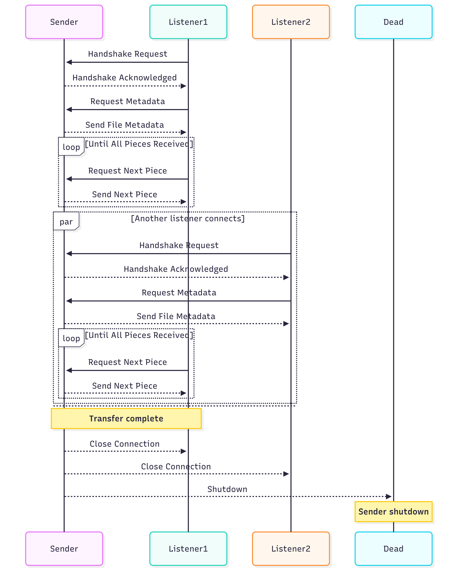

## Simple Peer to Peer File Transmission

### Introduction

I've spent the last 3 weeks(as of writing) building this simple very simple peer to peer file sharing "application". It's designed to solve an annoying issue; imagine you've just got a new laptop and you want to send file from you old potato pc to your new laptop. But, for whatever reason your old potato PC hates external hardrives. Why not jsut send file to your laptop over your local network?

- Note 1: This project is in it's infancy and is used to teach myself network programming.
- Note 2: This project is not secure!! only use on a network you trust.
- Note 3: Only works on a local network

### How it works

There exists 3 states, sender, receiver or listener and dead. There can exist only one sender, the sender machine finds an open port then starts a wildcard(`0.0.0.0`) TCP listener on that port. There can exist multiple listeners, the listeners connect to the sender port, an handshake performed with the sender, a for the file metadata is made. Once the metadata is received the listener can then begin requesting for the file piece by piece(stolen directly from bittorrent protocol). Dead means the sender is closed

Peer discovery is handle using [peerDiscovery](https://github.com/schollz/peerdiscovery). This is temporary until I learn enough network programming to roll my own solution.

The sender automatically becomes dead after a specified amount of time. Default is 3 minutes

Note: This project is a frankenstein's monster of different codebases, some created by me some from open source projects.

### Important to know

- This project has not been tested cross-platform
- This project is still in it's infancy
- Can only send one file at a time

### Upcoming features

- Resuming previous download
- Folder transfer
- CLI
- Custom peer discovery
- Docker image(after CLI)
